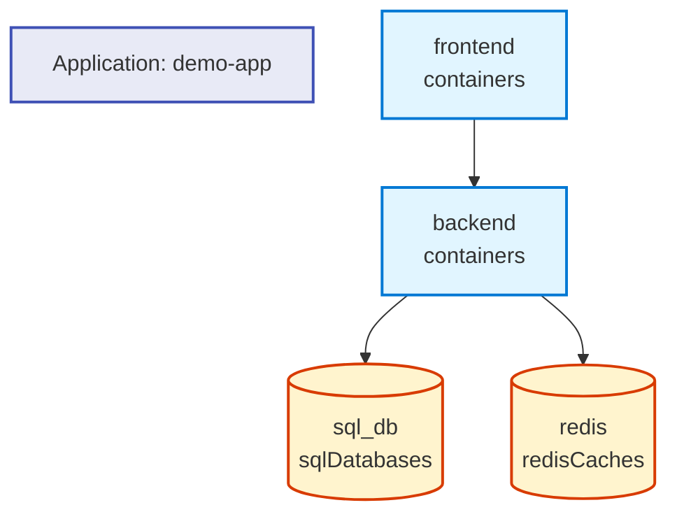
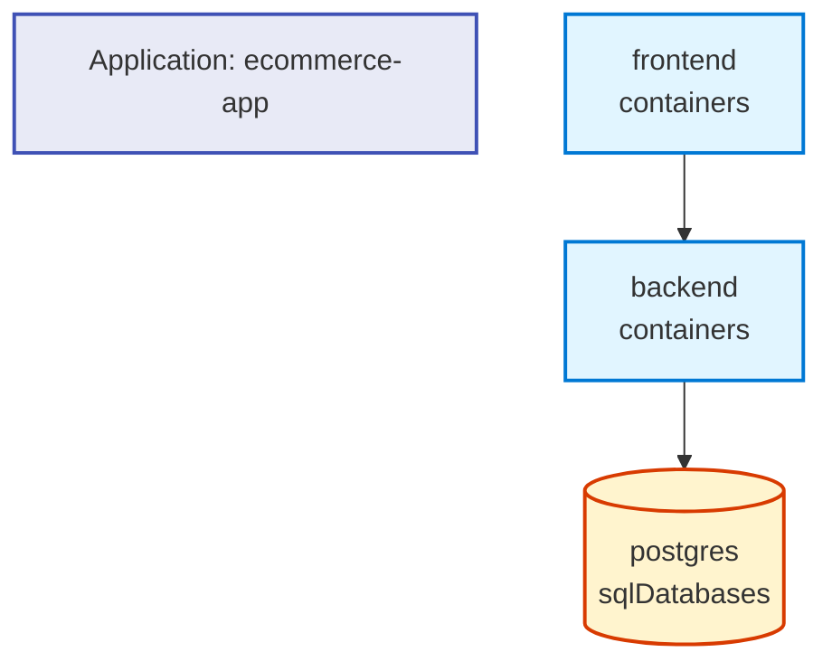

# Radius Application Graph Visualization

This document demonstrates the new GitHub-style Mermaid visualization for Radius application graphs.

## Overview

The `rad app graph` command now supports outputting application graphs in Mermaid diagram format, which renders natively in GitHub Markdown files.

## Usage

### Text Format (Default)

```bash
rad app graph my-application
```

or explicitly:

```bash
rad app graph my-application --format text
```

### Mermaid Format (GitHub-style)

```bash
rad app graph my-application --format mermaid
```

## Example Output

When you run `rad app graph --format mermaid`, you'll get output like this:



## Features

### Visual Elements

- **Different shapes** for different resource types:
  - Rectangles for containers
  - Cylinders for datastores
  - Diamonds for gateways
  
- **Color-coded** resources:
  - Blue for containers
  - Orange for datastores
  - Purple for gateways
  
- **Connection arrows** show the relationships between resources

### Benefits

1. **GitHub Integration**: Mermaid diagrams render natively in GitHub Markdown files
2. **Version Control**: Diagrams are text-based, so they're easy to version control
3. **Auto-updating**: Change your application, regenerate the graph, and commit - your documentation stays current
4. **Interactive**: GitHub's renderer makes the diagrams interactive and zoomable

## Example Scenario

Here's a simple web application with a frontend, backend, and database:



## Integration with Documentation

You can include these diagrams in your project README or documentation:

1. Run `rad app graph my-application --format mermaid > docs/architecture.md`
2. Commit the file to your repository
3. GitHub will automatically render the Mermaid diagram

## Implementation Details

The Mermaid visualization is implemented in the `pkg/cli/cmd/app/graph` package:

- `mermaid.go`: Contains the `displayMermaid` function that generates Mermaid syntax
- `mermaid_test.go`: Comprehensive tests for the visualization logic
- `graph.go`: Updated to support the `--format` flag

The visualization supports:
- Empty graphs
- Simple applications with a few resources
- Complex applications with many interconnected resources
- All Radius resource types
