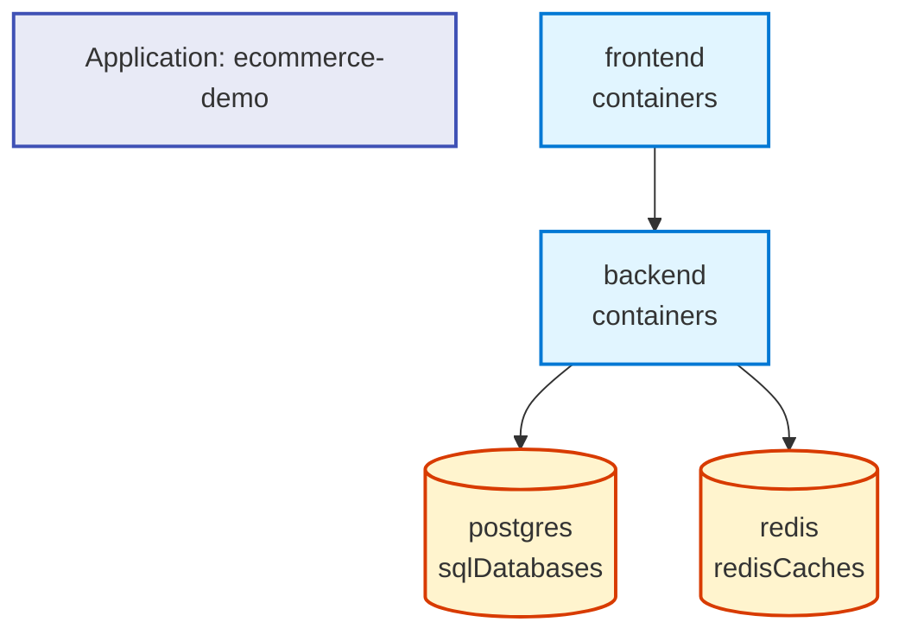

# Example: Visualizing a Real-World Application

This example demonstrates the new GitHub-style Mermaid visualization feature using a realistic e-commerce application.

## Application Structure

Our example application has:
- A React frontend served from a container
- A Node.js API backend in a container  
- A PostgreSQL database
- A Redis cache for session management
- An Azure Storage account for product images

## Command

```bash
rad app graph ecommerce-demo --format mermaid
```

## Output

The command generates this Mermaid diagram that renders in GitHub:



## What This Shows

1. **Frontend Container** (Blue Rectangle)
   - React SPA that users interact with
   - Connects to the backend API

2. **Backend Container** (Blue Rectangle)
   - Node.js/Express API server
   - Orchestrates data access and business logic
   - Connects to both database and cache

3. **PostgreSQL Database** (Orange Cylinder)
   - Primary data store
   - Holds product catalog, orders, user data

4. **Redis Cache** (Orange Cylinder)
   - Session storage
   - Caching layer for frequently accessed data

## Benefits in Practice

### For New Team Members
Opening the repository's README immediately shows the application architecture without needing to:
- Read through deployment configs
- Trace connections in code
- Ask the team for architecture docs

### For Code Reviews
When someone proposes adding a new service or connection, the PR can include an updated diagram showing the architectural impact:

```bash
# Before changes
rad app graph production --format mermaid > docs/before.md

# After changes  
rad app graph production --format mermaid > docs/after.md

# Include both in PR for visual comparison
```

### For Documentation
The diagram automatically updates when resources change:

```bash
# Add this to your CI/CD pipeline
- name: Update architecture diagram
  run: |
    rad app graph ${{ env.APP_NAME }} --format mermaid > README.md
    git add README.md
    git commit -m "docs: update architecture diagram"
```

## Comparison: Text vs Mermaid

### Text Format (Traditional)
```
Displaying application: ecommerce-demo

Name: frontend (Applications.Core/containers)
Connections:
  frontend -> backend (Applications.Core/containers)
Resources: (none)

Name: backend (Applications.Core/containers)
Connections:
  backend -> postgres (Applications.Datastores/sqlDatabases)
  backend -> redis (Applications.Datastores/redisCaches)
Resources: (none)

Name: postgres (Applications.Datastores/sqlDatabases)
Connections: (none)
Resources: (none)

Name: redis (Applications.Datastores/redisCaches)
Connections: (none)
Resources: (none)
```

### Mermaid Format (New)
Renders as the interactive diagram shown above! The visual format makes it much easier to understand the architecture at a glance.

## Complex Example: Microservices

For larger applications with many services, the visualization scales well:

```mermaid
graph TB
    app["Application: microservices-shop"]

    web["web-frontend<br/>containers"]
    api_gateway{"api-gateway<br/>gateway"]
    auth["auth-service<br/>containers"]
    products["products-service<br/>containers"]
    orders["orders-service<br/>containers"]
    payments["payments-service<br/>containers"]
    auth_db[("auth-db<br/>sqlDatabases")]
    products_db[("products-db<br/>sqlDatabases")]
    orders_db[("orders-db<br/>sqlDatabases")]
    cache[("shared-cache<br/>redisCaches")]

    web --> api_gateway
    api_gateway --> auth
    api_gateway --> products
    api_gateway --> orders
    api_gateway --> payments
    auth --> auth_db
    auth --> cache
    products --> products_db
    products --> cache
    orders --> orders_db
    orders --> cache
    payments --> cache

    classDef container fill:#e1f5ff,stroke:#0078d4,stroke-width:2px
    classDef datastore fill:#fff4ce,stroke:#d83b01,stroke-width:2px
    classDef gateway fill:#f3e5f5,stroke:#6a1b9a,stroke-width:2px
    classDef default fill:#e8eaf6,stroke:#3f51b5,stroke-width:2px

    class web container
    class auth container
    class products container
    class orders container
    class payments container
    class api_gateway gateway
    class auth_db datastore
    class products_db datastore
    class orders_db datastore
    class cache datastore
```

Even with 11 resources and multiple connections, the diagram remains clear and understandable!

## Conclusion

The GitHub-style Mermaid visualization makes Radius application architectures immediately visible and shareable. It's perfect for:

- 📚 Documentation that stays current
- 👥 Team onboarding and collaboration  
- 🔍 Architecture reviews and planning
- 📈 Tracking system evolution over time

And best of all - it requires zero additional tools or services. Just GitHub and the Radius CLI!
