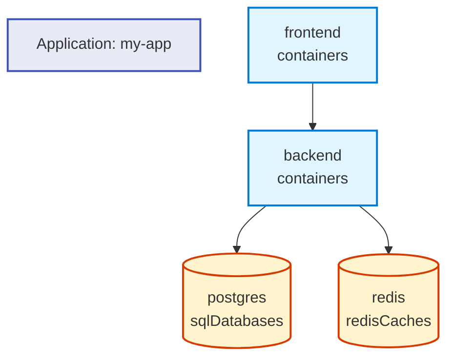

# Using the GitHub-Style Application Graph Visualization

## Quick Start

The `rad app graph` command now supports generating GitHub-native Mermaid diagrams:

```bash
# Traditional text output
rad app graph my-application

# GitHub-style Mermaid diagram
rad app graph my-application --format mermaid
```

## Example

Given a simple web application with these resources:
- `frontend` (container)
- `backend` (container)
- `postgres` (SQL database)
- `redis` (Redis cache)

Running `rad app graph my-app --format mermaid` produces:



## Benefits

1. **Native GitHub Rendering**: Mermaid diagrams render automatically in GitHub Markdown
2. **Version Control**: Text-based diagrams are easy to diff and track changes
3. **Always Up-to-Date**: Regenerate diagrams from live application state
4. **Interactive**: Diagrams are zoomable and navigable in GitHub

## Integrating with Documentation

### Update README automatically

```bash
# Generate and save to file
rad app graph my-application --format mermaid > README.md

# Or append to existing documentation
echo "## Application Architecture" >> docs/architecture.md
rad app graph my-application --format mermaid >> docs/architecture.md
```

### CI/CD Integration

Add to your CI pipeline to keep documentation current:

```yaml
- name: Update application diagram
  run: |
    rad app graph production-app --format mermaid > docs/architecture.md
    git add docs/architecture.md
    git commit -m "Update application architecture diagram"
```

## Visual Design

The visualization uses:

- **Rectangles** for containers and compute resources
- **Cylinders** for datastores (databases, caches)
- **Diamonds** for gateways and routing resources
- **Color coding**: Blue (containers), Orange (datastores), Purple (gateways)
- **Directional arrows** showing resource dependencies

## Supported Formats

| Format | Description | Use Case |
|--------|-------------|----------|
| `text` | Traditional text output (default) | Terminal viewing, logs |
| `mermaid` | GitHub Mermaid diagram | Documentation, GitHub README |

## Related Commands

- `rad app show` - Show application details
- `rad app list` - List all applications
- `rad resource list` - List resources in an application
