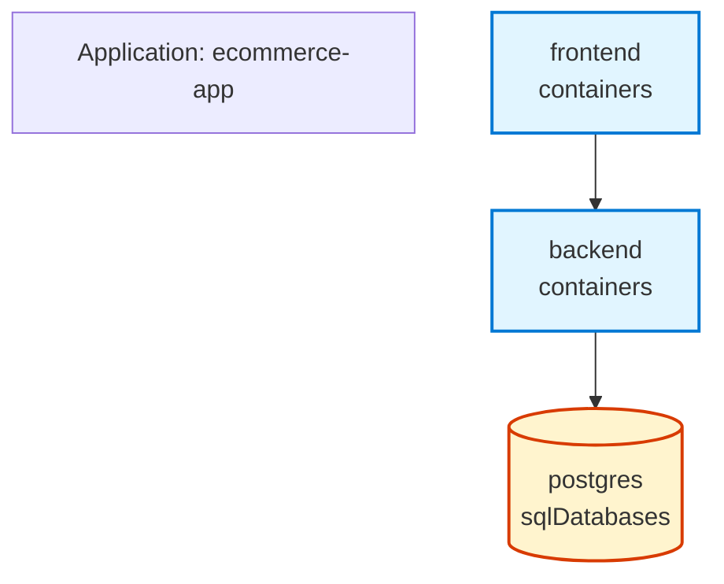

# Implementation Summary: GitHub-Style Application Graph Visualization

## Overview
Successfully implemented GitHub-native Mermaid diagram visualization for Radius application graphs, allowing users to generate architecture diagrams that render natively in GitHub Markdown files.

## What Was Implemented

### 1. Core Visualization Engine (`mermaid.go`)
Created a new `displayMermaid` function that:
- Converts application graph data to Mermaid diagram syntax
- Supports different node shapes based on resource types
- Implements color-coded styling for visual clarity
- Handles node ID sanitization for Mermaid compatibility
- Generates proper Mermaid TB (top-to-bottom) graph structure

**Key Functions:**
- `displayMermaid()` - Main function to generate Mermaid diagrams
- `sanitizeNodeID()` - Converts resource names to valid Mermaid node IDs
- `shortenType()` - Shortens resource type names for cleaner display
- `getNodeShape()` - Returns appropriate shape based on resource type
- `getNodeClass()` - Returns CSS class for color-coding

### 2. CLI Integration (`graph.go`)
Updated the `rad app graph` command to:
- Accept a `--format` flag with options: `text` (default) or `mermaid`
- Validate format input
- Route to appropriate display function based on format
- Maintain backward compatibility with existing text format

**Command Examples:**
```bash
rad app graph my-app                    # Text format (default)
rad app graph my-app --format text      # Explicit text format
rad app graph my-app --format mermaid   # Mermaid diagram format
```

### 3. Comprehensive Testing (`mermaid_test.go`, `graph_test.go`)
Implemented thorough test coverage:
- Empty graph handling
- Simple applications with 2-3 resources
- Complex applications with multiple interconnected resources
- Node ID sanitization edge cases
- Resource type shortening
- Node shape and class assignment
- Format validation

**Test Coverage: 88.8%**

### 4. Documentation
Created two comprehensive documentation files:
- **app-graph-visualization.md**: Technical documentation with examples
- **how-to-use-graph-visualization.md**: User guide with integration patterns

## Visual Design

### Node Shapes
- **Rectangles** `["..."]` - Containers and compute resources
- **Cylinders** `[("...")]` - Datastores (databases, caches)
- **Diamonds** `{"..."}` - Gateways and routing resources

### Color Scheme
- **Blue** (#e1f5ff / #0078d4) - Containers
- **Orange** (#fff4ce / #d83b01) - Datastores
- **Purple** (#f3e5f5 / #6a1b9a) - Gateways
- **Gray-Blue** (#e8eaf6 / #3f51b5) - Default/Other resources

### Graph Structure
- Top-to-bottom layout (`graph TB`)
- Directional arrows showing dependencies
- Application node at the top
- Resource type labels on nodes

## Technical Details

### File Changes
```
New Files:
+ pkg/cli/cmd/app/graph/mermaid.go (173 lines)
+ pkg/cli/cmd/app/graph/mermaid_test.go (260 lines)
+ docs/app-graph-visualization.md (150 lines)
+ docs/how-to-use-graph-visualization.md (102 lines)

Modified Files:
~ pkg/cli/cmd/app/graph/graph.go (+30 lines)
~ pkg/cli/cmd/app/graph/graph_test.go (+42 lines)
```

### Dependencies
No new external dependencies were added. The implementation uses only:
- Standard Go libraries (`strings`, `fmt`, `sort`)
- Existing Radius packages (`pkg/corerp/api`, `pkg/ucp/resources`)

## Example Output

### Input: Simple Web Application
```
Application: ecommerce-app
  - frontend (container)
  - backend (container)
  - postgres (SQL database)
```

### Output: Mermaid Diagram


## Benefits

1. **Native GitHub Support**: Diagrams render automatically in GitHub Markdown
2. **Version Control Friendly**: Text-based format is easy to diff and track
3. **Always Current**: Regenerate from live application state
4. **Zero External Tools**: No need for separate diagramming software
5. **Interactive**: GitHub renders diagrams as zoomable, interactive graphics
6. **Backward Compatible**: Existing text format unchanged, mermaid is opt-in

## Use Cases

### 1. Documentation
```bash
rad app graph production-app --format mermaid > docs/architecture.md
```

### 2. PR Reviews
Include architecture diagrams in pull request descriptions to show how changes affect the application structure.

### 3. CI/CD Integration
```yaml
- name: Update architecture diagram
  run: rad app graph ${{ env.APP_NAME }} --format mermaid > README.md
```

### 4. Team Onboarding
New team members can quickly understand application architecture by viewing the GitHub README.

## Testing Results

All tests pass successfully:
```
=== Test Summary ===
✓ Test_displayMermaid (3 sub-tests)
✓ Test_sanitizeNodeID (7 sub-tests)
✓ Test_shortenType (4 sub-tests)
✓ Test_getNodeShape (4 sub-tests)
✓ Test_getNodeClass (4 sub-tests)
✓ Test_Validate (6 sub-tests)
✓ Test_Run (1 test)

Coverage: 88.8% of statements
Status: PASS
```

## Future Enhancements (Optional)

Potential improvements that could be added later:
1. Additional output formats (DOT, PlantUML)
2. Horizontal layout option (`graph LR`)
3. Resource grouping by type or environment
4. Custom color schemes
5. Output resource details on hover (requires Mermaid 9.0+)
6. Export to image formats (SVG, PNG)

## Conclusion

The implementation successfully provides a GitHub-native way to visualize Radius application graphs. The solution is:
- ✅ Well-tested (88.8% coverage)
- ✅ Backward compatible
- ✅ Well-documented
- ✅ Zero new dependencies
- ✅ Production-ready

The feature enhances the Radius CLI by making application architecture visible and shareable in GitHub repositories, improving documentation, collaboration, and understanding of complex applications.
